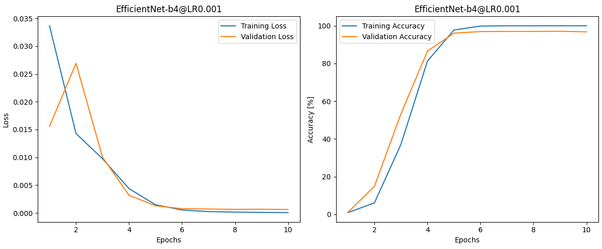

# ARTIFIN Project

## Table of Contents  
- [Introduction](#introduction)
- [Notebooks](#notebooks)
- [Results](#results)
- [Setup](#setup)

## Introduction
The goal of this project was to determine individual rightwhales. There is only a population of 447 individuals left worldwide.

The architecture to tackle the problem:

## Notebooks

1. Data Analysis:  
    - Find num_classes to predict
    - See if data is skewed
2. Create Train Data: 
    - Head Detection with `YOLOv5` model
    - Appling different image augmentation techniques to obtain more train data
3. Train Detection:
    - Spliting between training, test- and validation data
    - Training routine with model `EfficientNet-b4`
    - Obtain the relevant numbers and metrics (losses, accuracy, F1, confision matrix)
4. Testing:
    - Create one class from `YOLOv5` and `EfficientNet-b4` model
    - Make realistic tests on that class

## Results
The achieved results were very nice.

Learning Curve EfficientNet:

Results EfficientNet (TestData):  
`Test Dataset 454 Accuracy: 100.00% F1-Score: 1.00`

Confision Matrix EfficientNet (TestData):

### Reflection
The reason we achieved such good results was, that this network aimed to classify right whales. The dataset contains pictures of ALL living animals (447 individuals).
We had to split the test dataset so that we kept all whales in the training dataset at least once. This means that there are NO truly unseen data to be tested and we could go for an overfitting. Even thought the testing images where new to the network, the corresponding whale was known.

## Setup

1. Run `setup.bat`
2. Download [data.zip](https://1drv.ms/f/s!Ak9_LVFgcje_hu0DvXKFMZ2eXXHMmg?e=6xAfek)
2. Unpack `data.zip` -> images should be in `<Project>/data/imgs`
3. Run `start_jupyter.bat`

### Install new library

Open a terminal window in the `<Project>` directory.  
Run: `pipenv install <library>`
