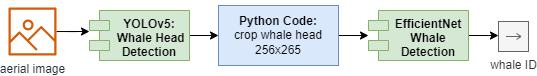

# ARTIFIN Project

## Table of Contents  
- [Overview](#overview)
- [Notebooks](#notebooks)
- [Setup](#setup)

## Overview

## Notebooks

1. Data Analysis
2. Data Preprocessing
3. Train Detection Algorith

## Setup

1. Run `setup.bat`
2. Download [data.zip](https://1drv.ms/f/s!Ak9_LVFgcje_hu0DvXKFMZ2eXXHMmg?e=6xAfek)
2. Unpack `data.zip` -> images should be in `<Project>/data/imgs`
3. Run `start_jupyter.bat`

### Install new library

Open a terminal window in the `<Project>` directory.  
Run: `pipenv install <library>`