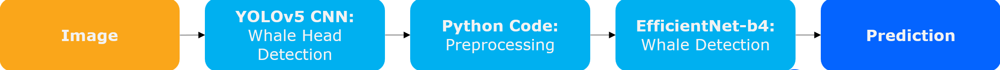
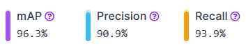

# ARTIFIN Project

## Table of Contents  
- [Introduction](#introduction)
- [Notebooks](#notebooks)
- [Results](#results)
- [Setup](#setup)

## Introduction
The goal of this project was to determine individual rightwhales. There is only a population of 447 individuals left worldwide.

Kaggle Project: https://www.kaggle.com/competitions/noaa-right-whale-recognition

The architecture to tackle the problem:

## Notebooks

1. Data Analysis:  
    - Find num_classes to predict
    - See if data is skewed
2. Create Train Data: 
    - Head Detection with `YOLOv5` model
    - Appling different image augmentation techniques to obtain more train data
3. Train Detection (Colab):
    - Spliting between training, test- and validation data
    - Training routine with model `EfficientNet-b4`
    - Obtain the relevant numbers and metrics (losses, accuracy, F1, confision matrix)
4. Testing:
    - Create one class from `YOLOv5` and `EfficientNet-b4` model
    - Calculate Metrics (Accuracy and F1-Score) from test dataset
    - Generate Confusion Matrix

## Results
The achieved results were very nice. `YOLOv5` model can efficiently locate right whale heads, which can be cropped and then feed into the `EfficientNet-b4` model to obtain the classification.

### `YOLOv5` Head Location:

#### Metrics  
  
Those metrics are based on the accuracy of the bounding box.

#### Head Location

### `EfficientNet-b4` Classification:

#### Learning Curves

`learning_rate` = 0.00001

`learning_rate` = 0.00025

#### Metrics  
275 whales individual whales were in the test dataset

`Train Accuracy: 100%`  
`Validation Accuracy: 23.5%`   
`Test Accuracy: 63.66 % Test F1-Score: 0.85`

#### Confision Matrix

### Reflection
The reason we achieved such good results was, that this network aimed to classify right whales. The dataset contains pictures of ALL living animals (447 individuals).
We had to split the test dataset so that we kept all whales in the training dataset at least once. This means that there are NO truly unseen data to be tested and we could go for an overfitting. Even thought the testing images where new to the network, the corresponding whale was already known. A bit surprising was, that the algorithm performed far better on the test data than at the validation data.

## Setup

### Prerequisites
- Python 3.11
- Pipenv installed

### Initialisation

1. Run `setup.bat`
or `pipenv install`
2. Download [imgs.zip](https://www.kaggle.com/competitions/noaa-right-whale-recognition/data)
2. Unpack `data.zip` &rarr; images should be extracted to `<project-directory>/data/imgs`

### Startup 

Run `start_jupyter.bat` or `pipenv shell` and `jupyter notebook`